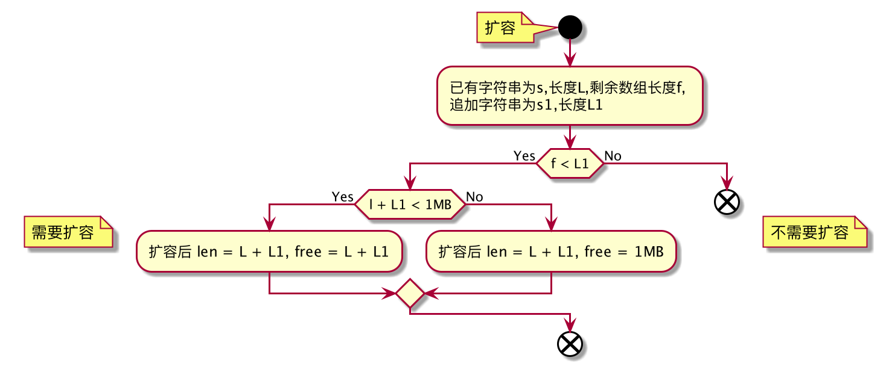

## 数据类型
　　常见的数据类型为String、List、Set、Hash、Sort Set
### String
　　Redis的String没有使用C自带的字符串(以空字符结尾的字符数组)，而是自己构建了一种名为简单动态字符串(simple dynamic string SDS)的抽象类型，并将SDS用作Redis的默认字符串表示。
#### 数据结构
```
    {
        int len;    //已使用长度
        int free;   //剩余空闲位置
        char buff[] //字节数组，用于保存字符串
    }
```
　　<font color=red size=1>同C一样以空字符结尾</font>
#### 空间预分配

#### 惰性释放空间
　　当SDS的API需要缩短SDS保存的字符串时，程序并不立即使用内存重新分配来收缩短后多出来的字节，而是使用free属性将这些字节的数量记录起来，并等待将来使用。

### List
#### 数据结构
　　每个链表节点使用一个adlist.h/listNode结构来表示:
```
    typedef struct listNode {
        // 前置节点
        struct listNode *prev;
        // 后置节点
        struct listNode *next;
        // 节点的值
        void *value;
    }
```
　　多个listNode可以通过prev和next指针组成双向链表；虽然仅仅使用多个listNode结构就可以组成链表，但是使用adlist.h/list来持有链表的话，操作起来会更方便:
```
    typedef struct list {
        // 头节点
        listNode *head
        // 尾节点
        listNode *tail
        // 链表所包含的节点数量
        unsigned long len;
        // 节点值复制函数
        void *(*dup)(void *ptr);
        // 节点值释放函数
        void *(*free)(void *ptr);
        // 节点值对比函数
        int (*match)(void *ptr, void *key);
    }
```
### 字典
